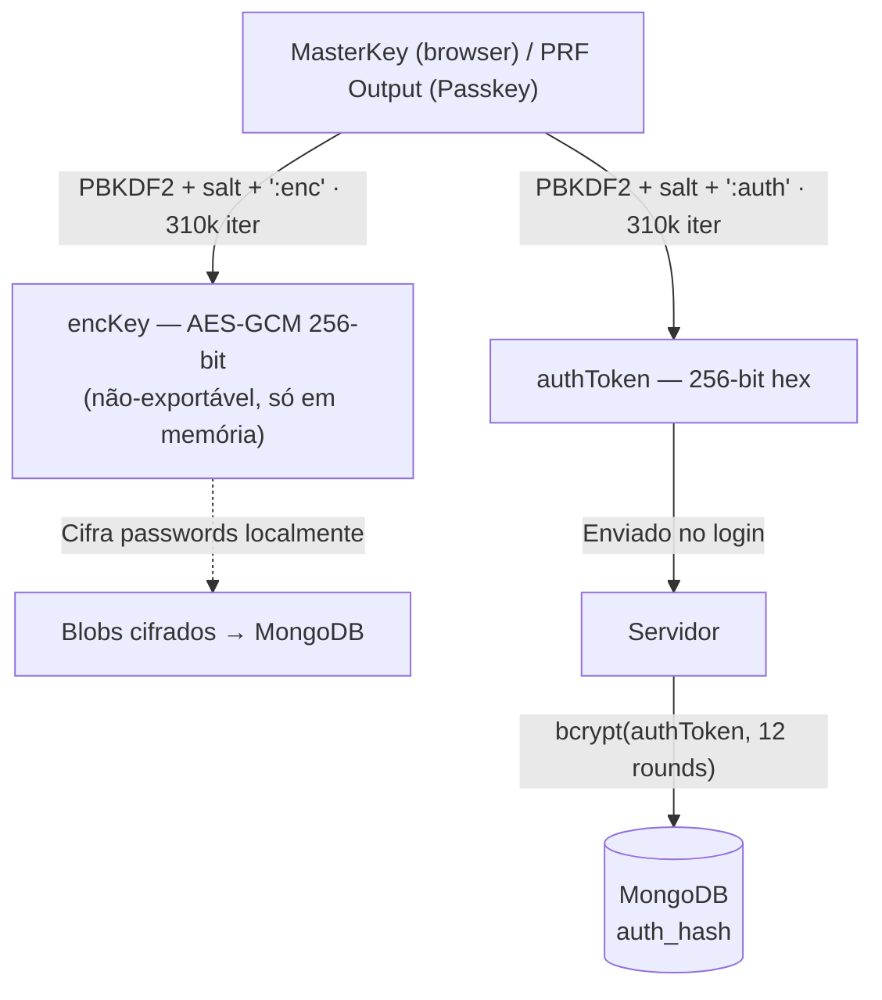

# KeyZero — One MasterKey. Zero Worries.

Gestor de passwords **Zero-Knowledge** desenvolvido para o Hackathon *Shift to Digital*. O servidor nunca vê, guarda nem transmite a tua MasterKey — toda a criptografia acontece exclusivamente no teu browser.

---

## Funcionalidades

- **Arquitetura Zero-Knowledge** — encKey e authToken derivados localmente via PBKDF2 (310 000 iterações, SHA-256); o servidor só armazena `bcrypt(authToken)`
- **Criptografia AES-GCM 256-bit** — passwords cifradas no browser antes de serem enviadas
- **Passkeys com WebAuthn PRF** — login biométrico zero-knowledge: a PRF Extension do WebAuthn substitui a MasterKey de forma transparente
- **Login por Ficheiro de Chave** — alternativa à MasterKey manual: chave de 256 bits gerada e guardada em disco; email validado pelo servidor antes de gerar o ficheiro; cancelar o picker não bloqueia a interface
- **Cofre CRUD** — adicionar, editar, copiar, apagar passwords com pesquisa em tempo real
- **Gerador CSPRNG** — `window.crypto.getRandomValues`, garante maiúscula, número e símbolo
- **Deteção de Phishing** — Google Safe Browsing API + typosquatting local (distância de Levenshtein)
- **Design responsivo, dark mode** — notificações toast, validação em tempo real da MasterKey

---

## Arquitetura Zero-Knowledge



As duas chaves derivadas são matematicamente independentes: comprometer o `authToken` não compromete o `encKey`, e vice-versa.

---

## Como Executar Localmente

### Pré-requisitos

- Node.js 18+
- MongoDB (Atlas ou servidor local `mongod`)

### Backend

```bash
cd backend
cp .env.example .env   # preenche MONGODB_URI e JWT_SECRET
npm install
npm run dev            # inicia em http://localhost:3001
```

### Frontend

```bash
cd frontend
npm install
npm run dev            # abre em http://localhost:5173
```

### Variáveis de Ambiente (`backend/.env`)

| Variável | Descrição | Exemplo |
|----------|-----------|---------|
| `PORT` | Porta do servidor | `3001` |
| `FRONTEND_URL` | URL do frontend (CORS + origin WebAuthn) | `http://localhost:5173` |
| `RP_ID` | Relying Party ID para WebAuthn | `localhost` |
| `MONGODB_URI` | URI de ligação ao MongoDB | `mongodb+srv://...` |
| `DB_NAME` | Nome da base de dados | `keyzero` |
| `JWT_SECRET` | Segredo para assinar JWTs (mín. 32 chars aleatórios) | *(gera com `node -e "console.log(require('crypto').randomBytes(64).toString('hex'))"`)* |
| `JWT_EXPIRES_IN` | Tempo de expiração do JWT | `7d` |
| `GOOGLE_SAFE_BROWSING_KEY` | API Key Google Safe Browsing (opcional) | `AIza...` |

---

## Estrutura do Projeto

```
KeyZero/
├── backend/
│   ├── middleware/
│   │   └── auth.js              # Middleware JWT (jose)
│   ├── routes/
│   │   ├── auth.js              # Registo e login clássico (2 passos ZK)
│   │   ├── passkeys.js          # WebAuthn PRF — registo e login
│   │   ├── passwords.js         # CRUD do cofre (protegido por JWT)
│   │   └── urlcheck.js          # Verificação Google Safe Browsing
│   ├── db.js                    # Ligação e wrapper MongoDB
│   ├── server.js                # Express + CORS + rotas
│   ├── package.json
│   └── .env.example
├── frontend/
│   └── src/
│       ├── context/
│       │   └── AuthContext.jsx  # Estado de autenticação em memória
│       ├── lib/
│       │   └── api.js           # Chamadas REST ao backend
│       ├── pages/
│       │   ├── LoginPage.jsx
│       │   ├── RegisterPage.jsx
│       │   └── Dashboard.jsx    # Cofre + gerador + phishing detection
│       └── utils/
│           ├── crypto.js        # PBKDF2, AES-GCM, CSPRNG, validação
│           ├── passkeys.js      # WebAuthn PRF client-side
│           └── fileAuth.js      # Login/registo por ficheiro de chave
├── DOCS.md                      # Documentação técnica detalhada
└── README.md
```

---

## Tecnologias

| Camada | Tecnologias |
|--------|------------|
| Frontend | React, Vite, TailwindCSS, Lucide React, Web Crypto API, `@simplewebauthn/browser` |
| Backend | Node.js, Express, `jose` (JWT), `bcryptjs`, `@simplewebauthn/server` |
| Base de dados | MongoDB (driver oficial) |
| Segurança | PBKDF2-SHA256, AES-GCM, WebAuthn PRF, Google Safe Browsing API |

---

## Equipa

Projeto desenvolvido para o Hackathon **Shift to Digital** por:

- [@henriquelaia](https://github.com/henriquelaia)
- [@Brunocor26](https://github.com/Brunocor26)

Toda a arquitectura foi desenhada para maximizar a segurança sem sacrificar a usabilidade.

Para documentação técnica detalhada, consulta [DOCS.md](./DOCS.md).
