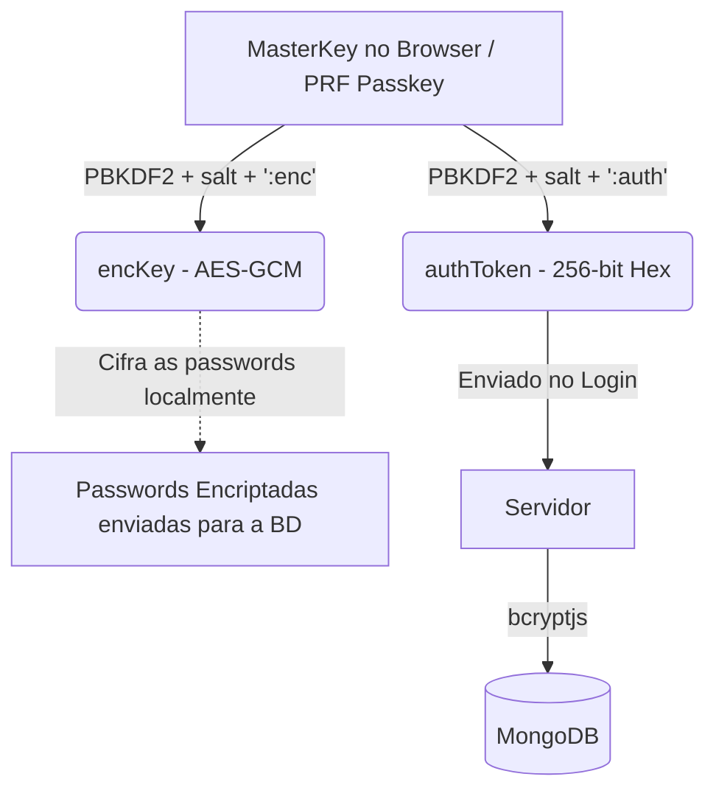

# 🛡️ KeyZero
> **One MasterKey. Zero Worries.**

Bem-vindo ao repositório do **KeyZero**, um gestor de passwords ultrasseguro desenvolvido para o Hackathon *Shift to Digital*. O KeyZero utiliza uma arquitetura **Zero-Knowledge** (Conhecimento Zero), garantindo que apenas tu tens acesso aos teus dados — o servidor nunca vê, guarda ou transmite a tua MasterKey.

---

## ✨ Funcionalidades Principais

* 🔒 **Arquitetura Zero-Knowledge**: A tua chave mestre (MasterKey) nunca sai do teu browser.
* 🛡️ **Criptografia de Nível Militar**: Utiliza PBKDF2-SHA256 para derivação de chaves e AES-GCM (256-bit) para cifrar as passwords no browser antes de as enviar para o servidor.
* 🔑 **Cofre de Passwords CRUD**: Adiciona, edita, vê, copia e apaga as tuas passwords agrupadas num dashboard intuitivo com funcionalidade de pesquisa em tempo real.
* 🎲 **Gerador de Passwords Seguro**: Ferramenta integrada com gerador criptograficamente seguro (CSPRNG) através de `window.crypto.getRandomValues`.
* 📱 **Design Responsivo & Moderno**: Interface dark-mode desenhada para funcionar perfeitamente em mobile e desktop, com notificações toast, skeletons de loading e badges de segurança.
* 🚦 **Validação Rigorosa da MasterKey**: O sistema obriga a regras fortes (mín. 12 caracteres, sem começar por maiúscula ou terminar em número, mistura de caracteres) validadas em tempo real.

---

## 🏗️ Estado do Projeto

O projeto encontra-se **funcional e implementado** nos seguintes componentes:

### 1. Base de Dados (MongoDB)
- Isolamento por utilizador (IDOR Prevention / Data partitioning)
- Passwords cifradas em JSON sem serem interpretáveis pela BD.

### 2. Backend (Node.js / Express)
- Endpoints de autenticação Zero-Knowledge (Registo e Login em 2 passos isolados).
- Autenticação com Passkeys integrando suporte para WebAuthn PRF.
- Endpoints CRUD protegidos via JWT.
- Integração de segurança com pacotes modernos compatíveis (`bcryptjs`, `jose`, `mongodb`).

### 3. Frontend (React / Vite)
- Gestão total da criptografia client-side (no ficheiro `utils/crypto.js` e `utils/passkeys.js`).
- Páginas completas e funcionais: Registo, Login e Dashboard do Cofre.
- Contexto de Autenticação state-of-the-art em memória (Zero persistência em localStorage para chaves sensíveis).

---

## 🧠 Como funciona a Arquitetura Zero-Knowledge?

O nosso maior diferencial é que a base de dados pode ser totalmente exposta e os teus dados continuam 100% seguros.



* **Separação de Chaves:** A partir de uma única MasterKey (ou biometria PRF), derivamos independentemente uma `encKey` (para cifrar dados) e um `authToken` (para fazer o login).
* Comprometer uma hash na base de dados requereria **+310.000 iterações** de brute-force por tentativa por causa do mecanismo PBKDF2.

---

## 🚀 Como Executar Localmente

### Pré-requisitos
* **Node.js 18+**
* **MongoDB** (Rodar um servidor mongod ou usar Atlas Cloud. Ajustar url no ficheiro .env `MONGODB_URI`).

### Passos de Instalação

1. **Iniciar o Backend:**
   ```bash
   ./start-backend.sh
   # Alternativa manual: cd backend && npm install && npm run dev
   # O servidor inicia em http://localhost:3001
   ```
   *(Nota: O servidor inclui a criação de um JWT_SECRET aleatório se usares o .env correto).*

2. **Iniciar o Frontend:**
   ```bash
   ./start-frontend.sh
   # Alternativa manual: cd frontend && npm install && npm run dev
   # A interface fica acessível em http://localhost:5173 
   ```

*(Certifica-te que os scripts `start-backend.sh` e `start-frontend.sh` têm permissões de execução executando `chmod +x start-*.sh`)*

---

## 🛠️ Tecnologias Utilizadas

* **Frontend:** React, Vite, TailwindCSS, Lucide React, API Web Crypto, SimpleWebAuthn.
* **Backend:** Node.js, Express, jose (para JWT), bcryptjs, SimpleWebAuthn.
* **Base de Dados:** MongoDB e pacote nativo oficial.
* **Infraestrutura:** Node.js.

---

### Equipa & Notas
Projeto desenvolvido para a prova do Hackathon "Shift to Digital". A versão atual reflete decisões desenhadas especificamente para maximizar a segurança limitando qualquer exposição lógica, sem sacrificar a conveniência de uso.
